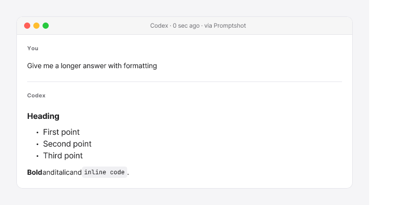

# Promptshot

Capture VS Code's secondary-sidebar AI chat (Codex / Claude Code) into beautiful PNG images or clean markdown for sharing.



## Features

- Captures last user → assistant exchange (single bubble pair)
- macOS-styled window chrome with traffic lights
- Sources: Codex (`~/.codex/sessions/`) and Claude Code (`~/.claude/projects/`)
- Cross-platform: Windows / macOS / Linux (no native modules)
- Image clipboard (paste into Slack/email) + file save
- Markdown clipboard mode (for wikis / GitHub)
- Auto-redacts common API keys / tokens (sk-..., gh[ps]_..., JWT, AWS, Google)
- Two themes: `mac-light` and `mac-dark`

## Usage

1. Install from VS Code Marketplace (link TBD after Task 10).
2. Use Codex or Claude Code in VS Code as usual.
3. Press `Ctrl+Alt+P` (Mac: `Cmd+Alt+P`) → image goes to clipboard + saves to `~/Pictures/Promptshot/`.
4. Paste into Slack/email.

### Commands

| Command | Default keybinding |
|---|---|
| Promptshot: Capture Last Exchange | `Ctrl+Alt+P` / `Cmd+Alt+P` |
| Promptshot: Capture as Markdown | (Command Palette only) |
| Promptshot: Pick Session… | (Command Palette only) |
| Promptshot: Choose Theme… | (Command Palette only) |
| Promptshot: Open Last Capture | (Command Palette only) |

### Settings

| Setting | Default | Description |
|---|---|---|
| `promptshot.theme` | `mac-light` | `mac-light` or `mac-dark` |
| `promptshot.source` | `auto` | `auto`, `codex`, or `claude-code` |
| `promptshot.outputDir` | `""` (→ `~/Pictures/Promptshot`) | Directory for saved PNGs |
| `promptshot.width` | `720` | Image width in pixels |
| `promptshot.maxHeight` | `4000` | Truncates very long messages |
| `promptshot.includeTools` | `false` | Include tool_use messages |
| `promptshot.includeSystem` | `false` | Include system messages |

## How it works

Promptshot reads the most recent JSONL session log from `~/.codex/sessions/` or `~/.claude/projects/`, extracts the last user→assistant exchange, and renders it with [Satori](https://github.com/vercel/satori) + [@resvg/resvg-js](https://github.com/yisibl/resvg-js) into a PNG. The PNG goes to clipboard via a hidden Webview using the browser Clipboard API — no native modules, fully cross-platform.

See [design spec](docs/superpowers/specs/2026-05-13-promptshot-design.md) and [decisions log](docs/DECISIONS.md) for details.

## Development

```bash
pnpm install
pnpm -r build
pnpm -r test
```

For local extension testing: open `packages/vscode-ext` in VS Code, press `F5` to launch Extension Development Host.

## License

MIT (see [LICENSE](LICENSE) — to be added).
